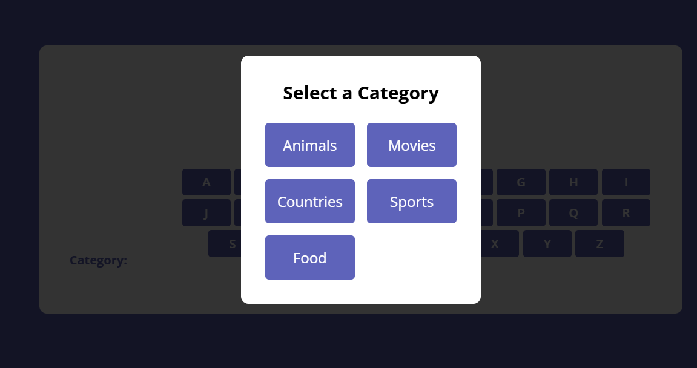
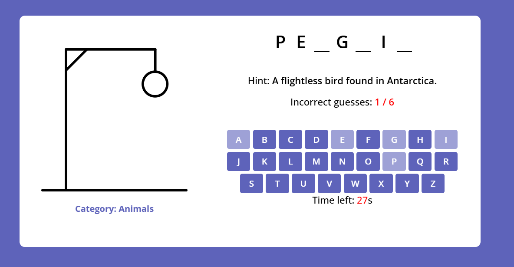

# Hangman Game

An interactive web-based Hangman game with category selection and time-based gameplay.


*Category Selection Screen - Players can choose from different categories like Animals, Movies, Countries, Sports, and Food*

## Game Features

### 1. Category Selection
- Start screen displays available word categories
- Categories are dynamically generated from the word list
- Each category contains themed words with relevant hints
- Click any category to start the game

### 2. Gameplay
- 30-second timer for each word
- Maximum of 6 incorrect guesses allowed
- Visual hangman representation updates with each wrong guess
- On-screen keyboard for letter selection
- Word display shows correct letter placements
- Helpful hints provided for each word

### 3. Game End Conditions

#### Win Scenario:
- Player correctly guesses all letters in the word
- Victory animation displays
- Shows the complete word and congratulatory message
- Option to play again with category selection


*Victory Screen - Shows when player successfully guesses the word*

#### Lose Scenario:
- Occurs when:
    - Player makes 6 incorrect guesses
    - 30-second timer runs out
- Shows the correct word
- Displays game over message
- Option to try again with new category selection

## Technical Implementation

### Word Categories
- Animals: Various creatures from different habitats
- Movies: Popular films across different genres
- Countries: Nations from around the world
- Sports: Different types of athletic activities
- Food: Various dishes and cuisines

### Game States
1. **Initial State**
    - Category selection modal visible
    - Main game hidden

2. **Active Gameplay**
    - Timer running
    - Keyboard enabled
    - Word display active
    - Hint visible
    - Current category shown

3. **End State**
    - Game result displayed
    - Correct word revealed
    - Play again button available

## How to Play

1. **Start Game**
    - Open the game in a web browser
    - Select a word category

2. **Gameplay**
    - Click letters on the virtual keyboard
    - Try to guess the word within 30 seconds
    - Use the hint if needed
    - Watch the hangman diagram
    - Keep track of incorrect guesses

3. **Winning/Losing**
    - Win by guessing all correct letters
    - Lose by making 6 wrong guesses or running out of time
    - Click "Play Again" to start a new game
    - Select a new category or stay with the current one

## Installation

1. Clone the repository:
```bash
git clone https://github.com/ahmedzaki147258/ITI-JS.git
```

2. Open `/lab3/index.html` in a web browser

No additional installation or dependencies required!

## Technologies Used
- HTML5
- CSS3
- JavaScript (ES6+)
- SVG for hangman graphics

## Future Enhancements
- Additional word categories
- Difficulty levels
- Multiplayer mode
- Score tracking
- Sound effects
- Mobile-responsive design improvements